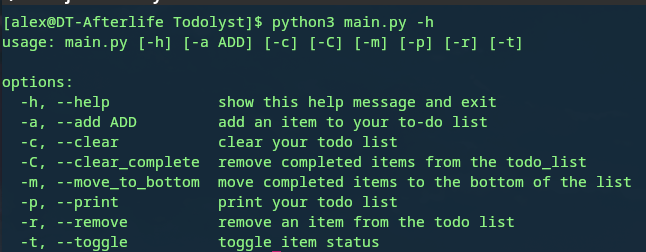

# To-Do Lyst
## A simple command line to-do list written in python
With To-Do Lyst you can create a simple list to stay organized and create clear, 
daily goals. You can add items to your list, remove them, toggle an item's 
completion status, change completed items' position on the list, remove completed
items, print the list, and clear the list
### Requirements
Python 3.6+
### Instructions
1. Clone the repository or download the zip (and extract it)
2. Navigate into the To-Do Lyst folder
### Usage
To get argument and option list:  
python3 main.py -h  
  

To add an item to the list:  
python3 main.py -a "Your item"  
  

To print the list:  
python3 main.py -p  
  

To remove an item from the list:  
python3 main.py -r  
  

To toggle the completion status of an item:  
python3 main.py -t  
  

To move the completed items to the bottom of the list:  
python3 main.py -m  
  

To clear completed items:  
python3 main.py -C  
  

To clear the list:  
python3 main.py -c  
  

You can also run multiple options at the same time  

To add items to you list and print  
python3 main.py -a "Item 1" "Item 2" "Item 3" "Item 4" "Item 5" -p  
  

To clear completed items and print:  
python3 main.py -C -p  
  
